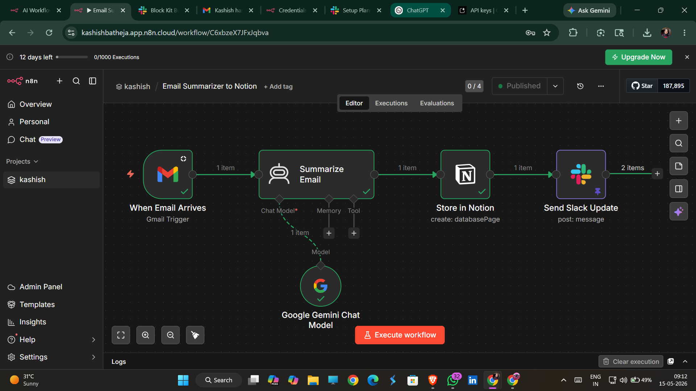

# AI Email Summarizer with n8n

An automation workflow built using n8n that:

- monitors incoming Gmail messages
- summarizes emails using OpenAI
- stores summaries in Notion

## Tech Stack
- n8n
- OpenAI API
- Gmail Trigger
- Notion API

## Workflow Preview

## Setup

1. Import `workflow.json` into n8n
2. Connect Gmail credentials
3. Add OpenAI API key
4. Connect Notion
5. Activate workflow

## Files

- `workflow.json` → exported n8n workflow
- `screenshots/` → workflow preview
- `.env.example` → required environment variables
